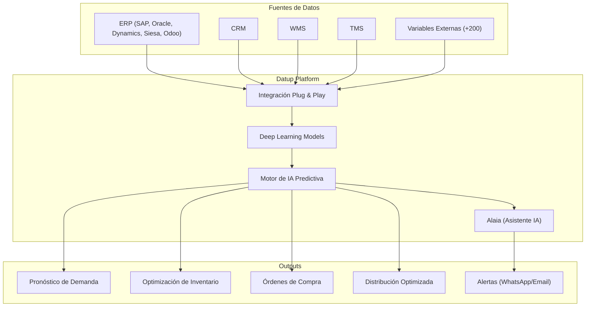
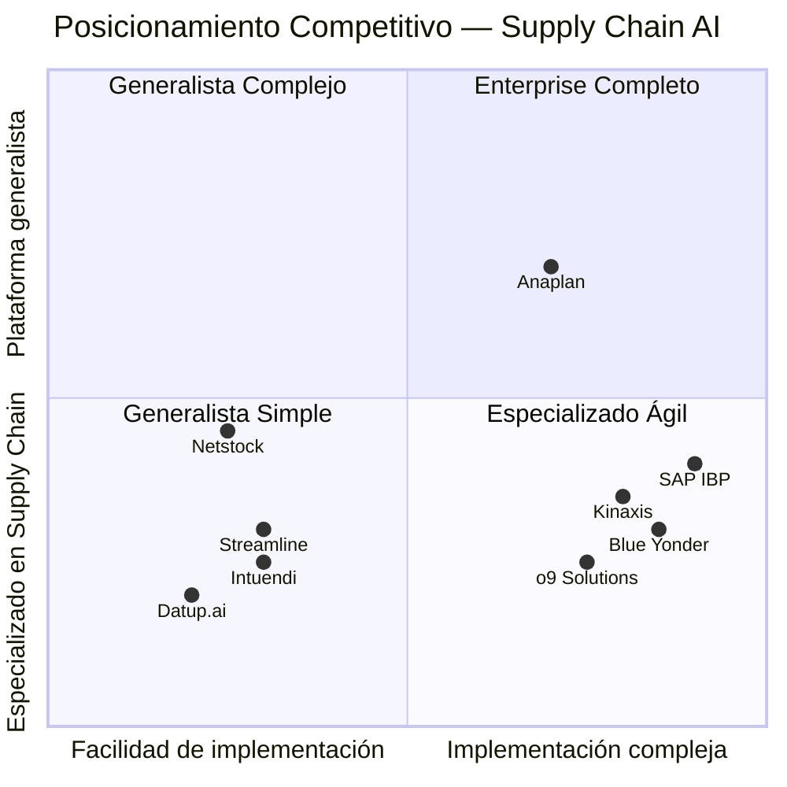

# 📊 Informe Competitivo: Datup.ai

> **Fecha:** 11 de junio de 2026  
> **Categoría:** Análisis de Competencia — Supply Chain Analytics con IA  
> **Website:** [datup.ai](https://datup.ai/)

---

## 1. Perfil de la Empresa

| Atributo | Detalle |
|---|---|
| **Nombre** | Datup |
| **Fundación** | 2019 |
| **Sede** | Bogotá, Colombia |
| **Tipo** | B2B SaaS (AIaaS — AI as a Service) |
| **Empleados** | ~20 personas (2026) |
| **ARR** | ~$2.2M USD (sept. 2025) |
| **Valoración** | ~$6.6M USD |
| **Financiamiento** | Principalmente bootstrapped (autofinanciada), con participación en aceleradoras (AWS GenAI Accelerator 2024) |
| **Idiomas del sitio** | Español, Inglés, Portugués |
| **Mercado objetivo** | LATAM y Europa |

### Fundadores / Liderazgo

| Nombre | Rol |
|---|---|
| **Felipe Hernández Anzola** | Co-Fundador |
| **Paola Serna** | Co-Fundadora |
| **Jullie Torres** | COO |
| **Ramiro Chaparro Vargas** | Co-Fundador |

### Reconocimientos
- 🏆 **#1 en categoría IA** en 100 Open Startups Colombia (2023, 2024)
- 🚀 Seleccionada para el **AWS Generative AI Accelerator 2024**

---

## 2. Propuesta de Valor

> *"Deja de perder dinero por agotados o exceso de stock, planifica la demanda y haz tus compras con datos e IA predictiva."*

Datup se posiciona como la plataforma de **Supply Chain Analytics con IA** diseñada específicamente para equipos de cadena de suministro en LATAM. Su propuesta central es:

1. **Conectar datos internos** (ERP, CRM, WMS, TMS) con **+200 variables externas** (inflación, clima, lead times, economía)
2. **Generar pronósticos de demanda** con >95% de precisión usando deep learning
3. **Automatizar recomendaciones de compra** y optimización de inventario
4. **Entregar valor en 5 semanas** de implementación (no meses)

### Métricas clave que promueven

| Métrica | Resultado |
|---|---|
| Implementación | **5 semanas** |
| Disminución de agotados | **4x menos** |
| Reducción exceso de inventario | **2.5x menos** |
| Precisión de pronósticos | **+95%** |

---

## 3. Portafolio de Productos / Módulos

### 3.1 📈 Planificación de la Demanda
**El módulo core de la plataforma.**

- Pronósticos precisos por **producto × ubicación**
- Escenarios de demanda incluyendo **productos nuevos**
- Comparación de demanda real vs. pronosticada (unidades y valor)
- Comparación de resultados actuales vs. períodos anteriores
- Horizontes de tiempo flexibles
- Colaboración con equipos de Ventas y Marketing

### 3.2 📦 Gestión de Inventarios y Compras
- **Puntos de reorden sugeridos** automáticamente
- Órdenes de compra basadas en pronósticos
- Coberturas mínimas y máximas recomendadas
- **Stock de seguridad dinámico** que se ajusta según cambios en inventario y lead time
- Pedidos basados en coberturas óptimas

### 3.3 🤝 S&OP / S&OE con IA
- Colaboración cross-funcional en reuniones de S&OP y S&OE
- Modificación colaborativa de pronósticos
- Alineación entre Supply Chain, Marketing, Ventas y Gerencia

### 3.4 🤖 Asistente de IA — "Alaia"
- Asistente conversacional de IA para cadena de suministro
- Consultas en **lenguaje natural** sobre demanda, inventario y portafolio
- Alertas y recomendaciones proactivas por **WhatsApp o correo electrónico**
- Contexto basado en los datos reales de la empresa

### 3.5 🔄 Reabastecimiento de Inventarios / Distribución Optimizada
- Sugerencias de **cuánto inventario enviar a cada punto de venta** o centro de distribución
- Priorización automática de puntos de venta con mayor demanda
- Lógica de **distribución por escasez**: cuando llega poco producto, se distribuye donde más impacto tiene
- Envío basado en pronósticos por ubicación

### 3.6 📊 Gestión y Ranking de Portafolio
- Clasificación inteligente de productos usando metodologías combinadas:
  - **ABC** (rentabilidad)
  - **FSN** (velocidad de rotación)
  - **XYZ** (estabilidad de demanda)
- Identificación de productos clave y productos volátiles
- Recomendaciones sobre en cuáles colaborar con ventas

---

## 4. Stack Tecnológico

### Integraciones ERP compatibles

| ERP | Versiones |
|---|---|
| **SAP** | S/4HANA, Business One |
| **Oracle** | Cloud, NetSuite |
| **Microsoft** | Dynamics 365 |
| **Siesa** | Enterprise |
| **Odoo** | (versiones actuales) |

### Características técnicas clave
- **Deep Learning** especializado para series temporales de supply chain
- **+200 variables externas** integradas (inflación, clima, política, lead times)
- Arquitectura **cloud-native** (infraestructura AWS)
- API-first / integración "Plug & Play"
- Implementación en **~5 semanas**

---

## 5. Clientes Principales

### Clientes confirmados (logos en website)

| Cliente | Industria | País |
|---|---|---|
| **Grupo Bimbo** | Alimentos / Panadería | México/LATAM |
| **Juan Valdez** | Café / Retail | Colombia |
| **Colsubsidio** | Retail / Caja de compensación | Colombia |
| **Crepes & Waffles** | Restaurantes / Food Service | Colombia |
| **Edgewell** | Consumo masivo | Multinacional |
| **Dislicores** | Licores / Distribución | Colombia |
| **Disfarma** | Farmacéutica / Distribución | Colombia |
| **Prebel** | Cosméticos | Colombia |
| **Dyna** | Industrial | Colombia |
| **Gabrica** | Mascotas / Alimentos | Colombia |

### Otros clientes mencionados en medios
- **Colgate** (consumo masivo)
- **L'Occitane** (cosméticos)
- **Faber-Castell** (papelería)
- **Pint Pharma** (farmacéutica)
- **Simoniz** (limpieza)
- **Nutresa** (alimentos)
- **Procaps** (farmacéutica)

### Sectores objetivo
1. 🏭 Manufactura
2. 🛒 Retail / Comercio
3. 🍞 Consumo masivo
4. 💊 Farmacéutica
5. 📦 Distribución
6. 🍽️ Food Service

---

## 6. Casos de Éxito Documentados

| Cliente | Resultado principal | Detalle |
|---|---|---|
| **Simoniz** | +85% precisión en pronósticos | Reducción significativa de exceso de inventario |
| **Casa Limpia** | +10% calidad de entregas | Implementación en 8 semanas, reducción de quiebres de stock |
| **Comfandi** | Optimización capital de trabajo | Mejora en disponibilidad de productos en red de droguerías |
| **Juan Valdez** | Monitoreo de mercado | "Herramienta ajustada a necesidades, precio competitivo, decisiones oportunas" |

---

## 7. Modelo de Precios

> [!IMPORTANT]
> Los precios exactos no son públicos. Se ofrece una demo personalizada para cotizar.

| Característica del modelo | Detalle |
|---|---|
| **Tipo** | Suscripción mensual (SaaS) |
| **Usuarios** | **Sin límite** — todos los colaboradores pueden acceder |
| **Permanencia** | **Sin cláusula de permanencia** |
| **Inicio de cobro** | Cuando la plataforma comienza a procesar datos |
| **Moneda** | USD |

### Herramientas gratuitas de conversión
- **Calculadora de ROI** pública en su website
- **Calculadora de errores de pronóstico** de demanda
- **Evaluador de prompts** para IA
- **Informe de digitalización Supply Chain 2026**
- **Curso de LinkedIn** para Supply Chain

---

## 8. Panorama Competitivo

### 8.1 Competidores Enterprise (soluciones end-to-end)

| Competidor | Mejor para | Diferencia vs. Datup |
|---|---|---|
| **o9 Solutions** | Grandes empresas con operaciones complejas | Altamente customizable, más caro, implementación larga |
| **Blue Yonder** | Retail y manufactura grandes | Muy establecido, pero legacy pesado, costos altos |
| **Kinaxis (Maestro)** | Planificación concurrente en tiempo real | Enterprise, precio muy alto, enfoque global |
| **SAP IBP** | Empresas con ecosistema SAP completo | Integración nativa SAP, pero rígido y costoso |
| **Anaplan** | Planning conectado (finanzas + supply chain) | Más amplio pero menos especializado en supply chain |

### 8.2 Competidores Mid-Market (los más similares a Datup)

| Competidor | Similitud con Datup | Diferencia clave |
|---|---|---|
| **GMDH Streamline** | Alta — AI forecasting, fácil de usar | Popular en SMBs globales, menos enfoque LATAM |
| **Netstock** | Media — puente entre Excel y enterprise | Más básico, enfocado en visibilidad de inventario |
| **Intuendi** | Alta — AI para scale-ups | Enfocado en reducir stockouts y exceso |
| **Pecan AI** | Media — predictive GenAI | Más general, no solo supply chain |

### 8.3 Mapa de posicionamiento

---

## 9. Estrategia Go-to-Market

### Canal de adquisición principal
- **Content Marketing & SEO**: Blog activo, herramientas gratuitas (calculadoras, informes)
- **Demo en vivo**: CTA principal en todo el sitio ("Agendar demo en vivo")
- **Casos de estudio**: Testimonios de clientes reconocidos
- **Partners ERP**: Programa de partners con integradores de ERP
- **LinkedIn**: Curso específico de Supply Chain, contenido educativo
- **Demos interactivas**: Uso de Arcade y Supademo para demos embebidas en el sitio

### Posicionamiento geográfico
- **Core**: Colombia y LATAM
- **Expansión**: Europa (probablemente a través de multinacionales)
- **Idiomas**: Español (principal), Inglés, Portugués (Brasil)

---

## 10. Análisis FODA (SWOT)

### ✅ Fortalezas
| # | Fortaleza |
|---|---|
| 1 | **Implementación ultra-rápida** (5 semanas vs. meses de competidores) |
| 2 | **Especialización profunda** en supply chain LATAM |
| 3 | **Clientes de marca** (Bimbo, Juan Valdez, Colgate) validan la solución |
| 4 | **Sin límite de usuarios** en la suscripción — baja fricción de adopción |
| 5 | **Sin permanencia** — reduce riesgo para el cliente |
| 6 | **+200 variables externas** integradas (clima, inflación, lead times) |
| 7 | **Asistente IA (Alaia)** con notificaciones proactivas por WhatsApp |
| 8 | **Bootstrapped y rentable** — no depende de VC para sobrevivir |
| 9 | Integraciones plug & play con ERP's principales de la región |

### ⚠️ Debilidades
| # | Debilidad |
|---|---|
| 1 | **Equipo pequeño** (~20 personas) — limitaciones de escalado |
| 2 | **Revenue modesto** ($2.2M ARR) — recursos limitados para I+D agresivo |
| 3 | **Concentración geográfica** fuerte en Colombia |
| 4 | **Sin precio público** — dificulta la comparación directa para compradores |
| 5 | **Marca poco conocida** fuera de LATAM |
| 6 | **Documentación técnica** no visible públicamente (APIs, SLAs, etc.) |

### 🚀 Oportunidades
| # | Oportunidad |
|---|---|
| 1 | **Expansión a Brasil** (ya tienen website en portugués) |
| 2 | **GenAI / LLMs** para mejorar el asistente Alaia |
| 3 | **Mercado LATAM sub-penetrado** en soluciones AI para supply chain |
| 4 | **Partner ecosystem** con integradores ERP regionales |
| 5 | Empresas medianas migrando de Excel → necesitan primera solución AI |

### 🔴 Amenazas
| # | Amenaza |
|---|---|
| 1 | **Competidores enterprise** (o9, Blue Yonder) bajando al mid-market |
| 2 | **ERPs nativos** (SAP, Oracle) mejorando sus módulos de IA predictiva |
| 3 | **Startups globales** (Streamline, Intuendi) expandiéndose a LATAM |
| 4 | **Herramientas genéricas de AI** (ChatGPT, Copilot) que democratizan forecasting básico |
| 5 | **Dependencia de pocos clientes grandes** en un mercado regional |

---

## 11. Comparación Directa: Datup vs. Alternativas Clave

| Criterio | **Datup.ai** | **GMDH Streamline** | **o9 Solutions** | **SAP IBP** |
|---|---|---|---|---|
| **Enfoque** | Supply Chain LATAM | Supply Chain global | Enterprise end-to-end | Ecosistema SAP |
| **Implementación** | ~5 semanas | ~4-8 semanas | 3-12 meses | 6-18 meses |
| **Usuarios** | Sin límite | Por licencia | Por licencia | Por licencia |
| **Precio** | Suscripción mensual accesible | Medio | Alto | Muy alto |
| **AI/ML** | Deep Learning + 200 vars | ML estadístico | AI/ML avanzado | ML integrado |
| **Asistente IA** | ✅ Alaia (WhatsApp) | ❌ | ✅ | Parcial (Joule) |
| **Integraciones ERP** | SAP, Oracle, Dynamics, Siesa, Odoo | Amplio | Amplio | Solo SAP |
| **Idiomas** | ES, EN, PT | EN principal | EN principal | Multi |
| **Mercado geo** | LATAM / Europa | Global | Global | Global |
| **Mejor para** | Mid-market LATAM | SMBs globales | Enterprises complejas | Ecosistema SAP |

---

## 12. Conclusiones Clave

> [!TIP]
> **Datup es un competidor serio en el nicho de Supply Chain AI para LATAM mid-market**, con una propuesta diferenciada en velocidad de implementación, precio accesible y experiencia regional.

### Lo que hacen bien:
1. **Time-to-value excepcional**: 5 semanas es agresivo y atractivo vs. meses de competidores enterprise
2. **Product-led growth**: Demo interactivas en el sitio, calculadoras, contenido educativo
3. **Enfoque regional profundo**: Entienden los ERP regionales (Siesa), las variables locales y el contexto LATAM
4. **Sin fricción comercial**: Sin permanencia + usuarios ilimitados elimina barreras de entrada

### Donde son vulnerables:
1. **Escala**: Equipo y revenue pequeños limitan su capacidad de competir contra players globales
2. **Marca**: Fuera de Colombia/LATAM su reconocimiento es mínimo
3. **Profundidad enterprise**: Para empresas muy grandes con operaciones globales complejas, pueden quedarse cortos

### Relevancia para Harness Forecaster:
- Datup opera en **supply chain / demand planning**, no en forecasting deportivo o de carreras
- Sin embargo, su **modelo de negocio SaaS** (suscripción, sin permanencia, usuarios ilimitados) es un referente interesante
- Su uso de **deep learning + variables externas** para predicción es conceptualmente similar a lo que Harness Forecaster podría hacer con variables de carreras
- Su estrategia de **content marketing + herramientas gratuitas** como generación de leads es replicable

---

*Informe generado a partir de análisis del sitio web datup.ai, búsquedas públicas y fuentes de datos de terceros (PitchBook, GetLatka, medios colombianos).*
