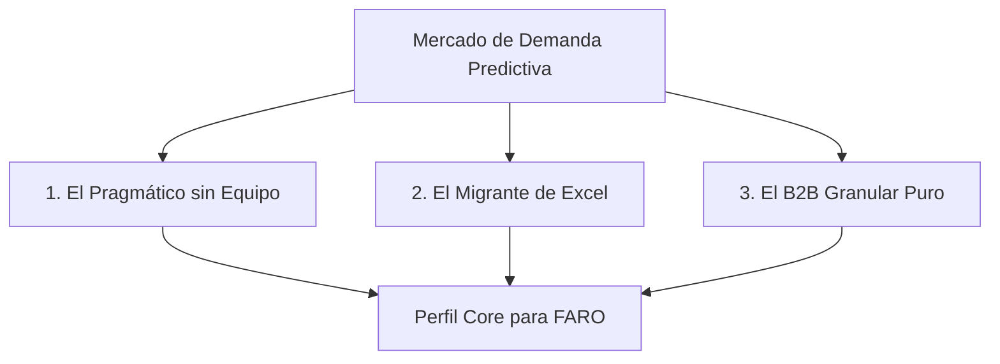

# Estrategia de Segmentación y Público Objetivo: FARO (Triple S)

> **Fecha:** 11 de junio de 2026  
> **Propósito:** Definición y recomendación de mercado objetivo, nicho estratégico y tamaño de empresa para el lanzamiento de FARO, basado en el análisis comparativo con Datup.ai.

---

## 1. Resumen Ejecutivo

FARO se diferencia en el mercado de Supply Chain Analytics a través de su modelo **Service as a Software (SaaSw)**: el cliente no opera el software, sino que consume pronósticos de demanda listos para usar generados por los agentes de IA de Triple S. 

Para maximizar el impacto comercial y operacional en el lanzamiento, se recomienda un enfoque quirúrgico y disciplinado: **empresas de Manufactura B2B de tamaño mediano (Categorías M y L)**. Este enfoque minimiza los costos de soporte de integración, reduce la fricción de venta al presentar un ROI inmediato y capitaliza sobre el desinterés de competidores tradicionales (como Datup) que buscan subir hacia el segmento enterprise generalista.

---

## 2. Segmentación del Público Objetivo para FARO

A partir de los hallazgos en [datup_competitor_analysis.md](file:///c:/Users/USUARIO/Documents/Triple%20S/Harness_Forecaster/documents/datup_competitor_analysis.md) y [datup_comparison.md](file:///c:/Users/USUARIO/Documents/Triple%20S/Harness_Forecaster/documents/datup_comparison.md), el mercado potencial se estructura en tres tipos de clientes según sus capacidades y necesidades:

### 2.1 El Pragmático sin Equipo (Core Target)
* **Perfil:** Empresas que sufren activamente por quiebres de stock o sobre-inventario, pero no cuentan con analistas de datos, ingenieros de supply chain o planificadores de demanda internos.
* **Dolor principal:** "No quiero capacitar a mi equipo en una plataforma compleja (como Datup) ni contratar científicos de datos. Solo quiero que me digan qué producir el lunes".
* **Alineación con FARO:** Perfecta. El modelo SaaSw de FARO asume la responsabilidad operativa completa del pronóstico.

### 2.2 El Migrante de Excel
* **Perfil:** Empresas medianas que gestionan la planificación con fórmulas complejas en hojas de cálculo. Han llegado a un cuello de botella operativo porque la variedad de SKUs y clientes hace inviable el control manual.
* **Dolor principal:** Pérdida de histórico, errores humanos en fórmulas, y falta de visibilidad estadística avanzada.
* **Alineación con FARO:** Alta. La transición de Excel a los entregables listos de FARO (Dashboard + Excel mensual) no requiere curva de aprendizaje técnica.

### 2.3 El B2B Granular Puro
* **Perfil:** Fabricantes que venden a otros negocios (B2B) con una alta volatilidad en los patrones de compra de cada cliente final.
* **Dolor principal:** Métodos estadísticos estándar fallan al analizar la combinación atómica de **cliente × producto × sede**.
* **Alineación con FARO:** Excelente. Los 11 harnesses de FARO analizan esta combinación como unidad mínima de análisis de forma nativa.

---

## 3. Recomendación de Nicho: Manufactura B2B

Se recomienda enfocar el posicionamiento de FARO exclusivamente en el sector de **Manufactura B2B** (químicos, empaques, productos de limpieza industrial, autopartes, componentes y materiales industriales).

### Razones estratégicas:

1. **Evitar la dilución del producto:** Competidores como Datup cubren desde grandes cadenas de comida rápida hasta multinacionales de consumo masivo, lo que los obliga a desarrollar módulos de distribución entre ubicaciones, órdenes de compra automatizadas, rankings de portafolio y asistentes por WhatsApp (Alaia). FARO mantiene su ventaja al ser un cirujano especializado: **pronóstico ultra-preciso de demanda B2B**.
2. **Ciclos de venta más claros:** Los decisores en manufactura industrial (Directores de Operaciones, Gerentes de Planta) entienden perfectamente el costo financiero de parar una línea de producción por falta de materia prima o de tener bodega llena. El ROI de FARO se calcula de forma directa en estos escenarios.
3. **Estacionalidad y Cold Start predecible:** La estacionalidad B2B industrial suele estar atada a factores macroeconómicos, cierres anuales o calendarios de auditoría de sus propios clientes (por ejemplo, auditorías alimentarias en rastros o empacadoras). Esto es más modelable mediante la lógica de agentes de FARO que la estacionalidad impulsiva del retail.

---

## 4. Tamaño de Empresa Recomendado: Categorías M y L (Medianas)

La clasificación de tamaño de FARO utiliza el **Índice de Tamaño Operativo (ITO)**, que combina SKUs activos, clientes y volumen de pedidos. Se recomienda priorizar el segmento mediano:

| Categoría | Precio Mensual | Target Operativo | Justificación Estratégica |
| :---: | :---: | :--- | :--- |
| **M** | USD 200 | Medianas-Pequeñas | Proceso de toma de decisiones rápido. El costo es inferior a un software básico y no requiere aprobaciones de junta directiva. |
| **L** | USD 350 | Medianas | El cliente típico con suficiente histórico en su ERP local (Microsip, Siesa) y dolor activo de sobre-inventario. ROI evidente desde el mes 2. |

### Por qué evitar el segmento XL (Enterprise) en el lanzamiento:
* **Fricción en Onboarding:** Las corporaciones gigantes exigen integraciones complejas de TI, APIs en tiempo real y protocolos de seguridad que retrasan el onboarding más allá de los 3 meses estipulados en el diseño de FARO.
* **Requerimiento de Software Interactivos:** El segmento XL prefiere operar herramientas internamente para mantener el control político del pronóstico, chocando con la filosofía SaaSw.
* **Costo de soporte:** Una empresa XL consumiría el ancho de banda del equipo de Triple S, reduciendo la capacidad de escalar en volumen de clientes medianos.

---

## 5. Propuesta de Valor y Hook de Go-To-Market

Para capturar este mercado frente a plataformas tradicionales, la narrativa de ventas debe centrarse en la simplicidad y en el valor antes de cobrar:

> **El Hook de Venta:**  
> *"Nosotros operamos la IA por ti. No pagues una plataforma compleja para entrenar a tu personal; recibe directamente el pronóstico de demanda óptimo para tu producción en un archivo listo para usar, por el costo mensual de un salario mínimo."*

### Los 3 Pilares del Hook:
1. **Mes 1 Gratuito con Diagnóstico de Datos (ISD):** Es el "caballo de Troya". FARO evalúa los datos del cliente sin costo y le entrega un reporte detallado de calidad de información. Esto genera confianza inmediata y demuestra valor antes de que el cliente realice su primer pago en el Mes 2.
2. **Esquema de precios sin permanencia y variable por ISD:** La tarifa de USD 200–350 con un cargo variable inverso al Índice de Salud de Datos (a mejores datos, menor precio) alinea los incentivos de mejora de datos del cliente con FARO.
3. **Garantía contractual de SLAs:** Publicar SLAs de MAPE vinculados al ISD genera una imagen de alta seriedad corporativa frente a competidores que ocultan su precisión real.

---

*Documento de lineamiento estratégico del proyecto FARO - Sabbia Solutions & Software (Triple S).*
